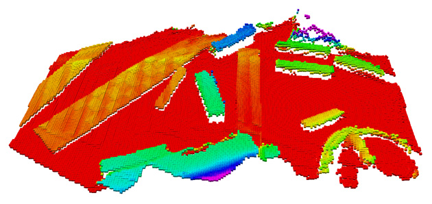

# hero_chassis_controller

## Overview

The Hero Chassis Controller is a ROS package for controlling a Mecanum-wheeled robot chassis. It includes PID control for wheel velocities, odometry calculation, inverse kinematics for velocity transformations, and the ability to switch between global and local coordinate systems.

**Keywords:** Mecanum wheel, PID control, odometry, velocity transformation

### License

The source code is released under a [BSD 3-Clause license](LICENSE).

**Author: Richard<br />
Affiliation: [ANYbotics](https://www.anybotics.com/)<br />
Maintainer: Richard, wang13530080747@gmail.co**m

The `hero_chassis_controller` package has been tested under ROS Noetic on Ubuntu 20.04.

It is designed for educational and research purposes and may be updated frequently.

[](http://rsl-ci.ethz.ch/job/ros_best_practices/)



[comment]: <> (### Publications)

[comment]: <> (If you use this work in an academic context, please cite the following publication&#40;s&#41;:)

[comment]: <> (* P. Fankhauser, M. Bloesch, C. Gehring, M. Hutter, and R. Siegwart: **PAPER TITLE**. IEEE/RSJ International Conference)

[comment]: <> (  on Intelligent Robots and Systems &#40;IROS&#41;, 2015. &#40;[PDF]&#40;http://dx.doi.org/10.3929/ethz-a-010173654&#41;&#41;)

[comment]: <> (        @inproceedings{Fankhauser2015,)

[comment]: <> (            author = {Fankhauser, P\'{e}ter and Hutter, Marco},)

[comment]: <> (            booktitle = {IEEE/RSJ International Conference on Intelligent Robots and Systems &#40;IROS&#41;},)

[comment]: <> (            title = {{PAPER TITLE}},)

[comment]: <> (            publisher = {IEEE},)

[comment]: <> (            year = {2015})

[comment]: <> (        })

## Installation

### Installation from Packages

To install all packages from the this repository as Debian packages use

    sudo apt-get install ros-noetic-...

Or better, use `rosdep`:

	sudo rosdep install --from-paths src

### Building from Source

#### Dependencies

- [Robot Operating System (ROS)](http://wiki.ros.org) (middleware for robotics),
- control_toolbox (PID control library)
- dynamic_reconfigure (for runtime parameter tuning)
- tf (transformations)

#### Building

To build from source, clone the latest version from this repository into your catkin workspace and compile the package
using

	cd ~/catkin_ws/src
	git clone https://github.com/Richard-cc172/hero_chassis_controller.git
	cd ~/catkin_ws
	catkin_make

### Running in Docker

Docker is a great way to run an application with all dependencies and libraries bundles together. Make sure
to [install Docker](https://docs.docker.com/get-docker/) first.

First, spin up a simple container:

	docker run -ti --rm --name ros-container ros:noetic bash

This downloads the `ros:noetic` image from the Docker Hub, indicates that it requires an interactive terminal (`-t, -i`)
, gives it a name (`--name`), removes it after you exit the container (`--rm`) and runs a command (`bash`).

Now, create a catkin workspace, clone the package, build it, done!

	apt-get update && apt-get install -y git
	mkdir -p /ws/src && cd /ws/src
	git clone https://github.com/Richard-cc172/hero_chassis_controller.git
	cd ..
	rosdep install --from-path src
	catkin_make
	source devel/setup.bash
	roslaunch hero_chassis_controller hero_chassis_controller.launch

## Usage

Describe the quickest way to run this software, for example:

Run the main node with

	roslaunch hero_chassis_controller hero_chassis_controller.launch

Control the robot using:

```
rosrun teleop_twist_keyboard teleop_twist_keyboard.py cmd_vel:=/cmd_vel
```

To switch between local and global coordinate systems, modify the `speed_mode` parameter in the YAML configuration file and restart the node.


## Config files

* **chassis_params.yaml** 

  Contains the following configurable parameters:

  - **`wheel_radius`**: Radius of the wheels.
  - **`wheel_base`**: Distance between the front and rear wheels.
  - **`wheel_track`**: Distance between the left and right wheels.


* **pid_config.yaml** 

  Contains PID parameters for wheel controllers:

  - **`p`**: Proportional gain.

  - **`i`**: Integral gain.

  - **`d`**: Derivative gain.

  - **`i_clamp`**: Integral windup limit.

    

## Launch files

* **hero_chassis_controller.launch** 

  **`speed_mode`**: Determines the coordinate system for velocity control (`local` or `global`).

  **`config_file`**: Path to the YAML configuration file.

  

* **velocity_transform.launch**

  Launches the velocity transformation node.

  

## Nodes

### velocity_transform_node

Reads temperature measurements and computed the average.

* Transforms velocity commands between global and local coordinate systems.

  #### Subscribed Topics
  
  - **`/cmd_vel`**: ([geometry_msgs/Twist]) Input velocity commands.
  
  #### Published Topics
  
  - **`/transformed_cmd_vel`**: ([geometry_msgs/Twist]) Transformed velocity commands in the appropriate coordinate system.
  - **`/joint_states`**: ([sensor_msgs/JointState]) Wheel speed commands.
  
  #### Parameters
  
  - **`speed_mode`**: Switch between `local` and `global` modes.

### hero_chassis_controller_node

Implements PID-based control for the Mecanum wheels and handles odometry calculations.

#### Subscribed Topics

- **`/cmd_vel`**: ([geometry_msgs/Twist]) Velocity commands.
- **`/joint_states`**: ([sensor_msgs/JointState]) Current wheel states.

#### Published Topics

- **`/odom`**: ([nav_msgs/Odometry]) Odometry data for the robot.

#### Parameters

- **`chassis_params.yaml`**: Includes wheel dimensions and robot kinematics.

- **`pid_config.yaml`**: PID controller parameters.

  

## Testing

Use the following commands for testing:

- Publish velocity commands:

  ```
  rostopic pub /cmd_vel geometry_msgs/Twist -r 10 -- '[1.0, 0.0, 0.0]' '[0.0, 0.0, 0.0]'
  ```

- Visualize odometry in RViz and verify the robot's behavior.

### Tools

- Use `rqt_reconfigure` to tune PID parameters in real-time.

- Use `plotjuggler` to visualize the robot's odometry and wheel velocities.

  

## Bugs & Feature Requests

Please report bugs and request features using the [Issue Tracker](https://github.com/gdut-dynamic-x/rm_template/issues)
.


[ROS]: http://www.ros.org

[rviz]: http://wiki.ros.org/rviz

[Eigen]: http://eigen.tuxfamily.org

[std_srvs/Trigger]: http://docs.ros.org/api/std_srvs/html/srv/Trigger.html

[sensor_msgs/Temperature]: http://docs.ros.org/api/sensor_msgs/html/msg/Temperature.html
